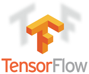

This repo is all my efforts of studies for programming
(Actively commit since 2019)

This repo mainly contains 3 folders which are Education, Papers and Programming Language.

### Short Intro  
#### Field of Interest  
- Natural Language Processing Field (Especially long turn of Human-like Dialogue / Chatting-bot)  
- Speech / Voice related field  
- Human-like AI  
#### Main Language & Library 
  
